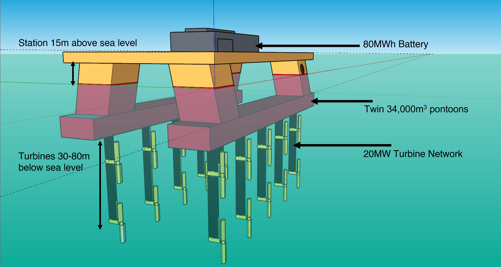

<h1 align="center">
   
  
   
    OffCharge
   
</h1>

<h4 align="center">An entrepreneurship project developed as part of NES Ground Zero 2022.</h4>

  <a href="#about-offcharge">About OffCharge</a> •
  <a href="#credits">Credits</a> •
  <a href="#license">License</a>

## About OffCharge
OffCharge is the leading provider of global offshore charging solutions for electric ships. We are the first in the world to launch offshore charging platforms in deep seas capable of fully charging electric ships. Our advanced technology provides electricity for ships using clean energy generated by hydropower, turning long-haul trips for electric ships from fantasy to reality. Our efforts have significantly reduced carbon emissions from the maritime industry, constructing a more sustainable and eco-friendly future for everyone. Contact us to find out how you can be part of this revolutionary change.

You can preview OffCharge [here](https://offcharge.netlify.app/).

## Credits

This website was forked and modified from the [Rohit-singh19/Website-template](https://github.com/Rohit-singh19/Website-template) repository and was deployed to the internet with [Netlify](https://www.netlify.com/).

* 3D Models: [SketchUp](https://www.sketchup.com/)
* Icons: [Font Awesome](https://fontawesome.com/icons)
* Video Hosting: [Wistia](https://wistia.com/)
* Appointment Scheduling: [Calendly](https://calendly.com/)
* Support Infrastructure: [Freshdesk](https://freshdesk.com/)

## License

MIT

---

> GitHub [@nicholasohjj](https://github.com/nicholasohjj) &nbsp;&middot;&nbsp;
> Linkedin [@nicholasohjj](https://www.linkedin.com/in/nicholasohjj)

